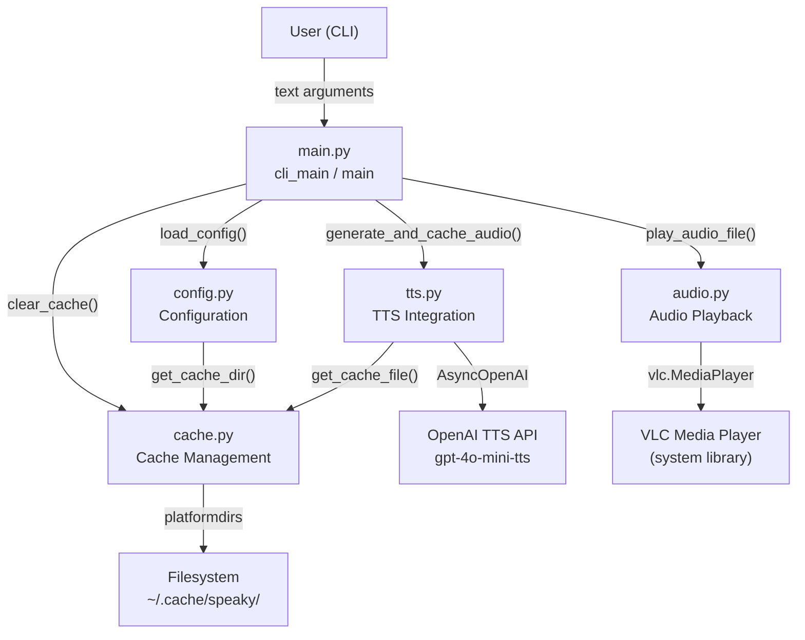
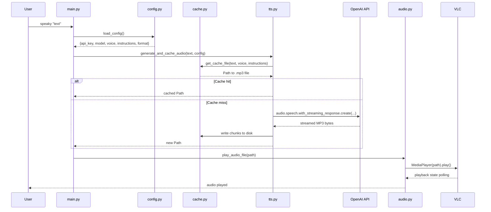

## Overview

Speaky is a single-repo Python CLI application that accepts text input, generates MP3 audio via the OpenAI TTS API, caches the result on disk, and plays it back through VLC. The package is distributed as a standard Python package with a registered console script entry point.

## Component Map



## Request Lifecycle



## Module Responsibilities

| Module | Responsibility |
| --- | --- |
| `main.py` | Argument parsing, orchestration, error handling, async event loop |
| `config.py` | Environment loading, cache directory resolution, static TTS parameters |
| `cache.py` | Cache key generation (MD5), file path construction, cache clearing |
| `tts.py` | OpenAI API calls, streaming response handling, writing audio to cache |
| `audio.py` | VLC player lifecycle: create, play, poll state, stop, release |

## Entry Point

The package declares a console script in `pyproject.toml`:

```
speaky = "speaky.main:cli_main"
```

`cli_main` wraps `asyncio.run(main())` and catches `KeyboardInterrupt`, mapping it to `sys.exit(1)`. All async I/O (the OpenAI streaming call) runs inside the single event loop created by `asyncio.run`.

## Technology Choices

| Choice | Rationale |
| --- | --- |
| Python 3.10+ | Match system Python on CI (`ubuntu-latest`); sufficient for `str \| Path` union type hints |
| `asyncio` + `AsyncOpenAI` | OpenAI's streaming TTS response is natively async; avoids blocking the process during download |
| `python-vlc` | Thin binding to libVLC; handles MP3 decoding and audio device routing without additional codec dependencies |
| `platformdirs` | Resolves the correct per-OS cache path (`~/.cache/speaky` on Linux/macOS) without hard-coding paths |
| MD5 cache keys | Fast, collision-resistant enough for keying on `text::voice::instructions`; not used for security |
| `load-dotenv` | Allows `OPENAI_API_KEY` to be stored in a `.env` file alongside the project without shell export boilerplate |
| `setuptools` + `wheel` | Standard build backend; compatible with both `pip install` and `uv pip install` |

## Getting Started

Prerequisites: Python 3.10+, `uv` (or `pip`), VLC installed on the host system.

```
uv sync
uv pip install -e .
cp example.env .env   # add OPENAI_API_KEY
speaky "Hello world"
```

Test suite:

```
uv sync --extra test
uv run pytest --tb=short
```
