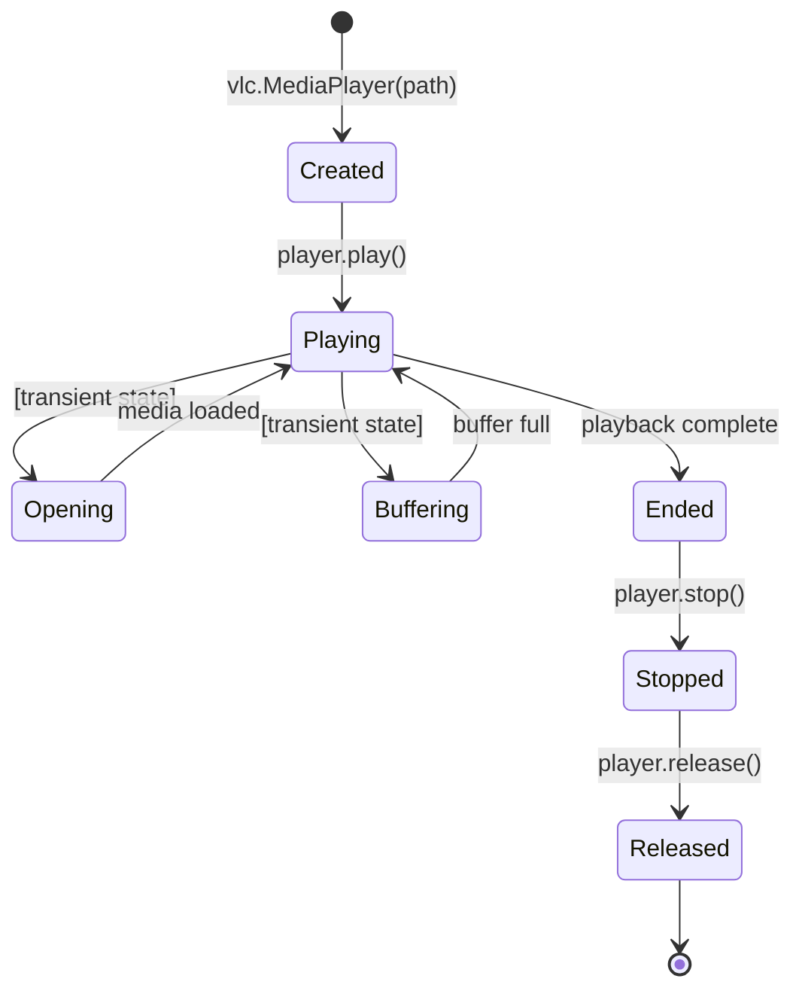

## Overview

`audio.py` plays an MP3 file using the `python-vlc` binding to libVLC. Playback is synchronous: the function blocks until VLC reports the media has finished, then explicitly stops and releases the player.

## Playback Lifecycle



The function waits 0.5 seconds after calling `player.play()` before entering the state-poll loop. This sleep gives VLC time to transition out of an uninitialised state before the first `get_state()` call.

## State Polling

The poll loop calls `player.get_state()` every 0.1 seconds and continues while the state is any of:

- `vlc.State.Playing`
- `vlc.State.Opening`
- `vlc.State.Buffering`

Any other state (including `vlc.State.Ended`, `vlc.State.Error`, or `vlc.State.Stopped`) exits the loop. This means the function returns cleanly on both successful completion and on VLC-level errors; it does not distinguish between them.

## Function Signature

`play_audio_file(file_path: str | Path) -> None`

- `file_path`: path to the MP3 file; accepts both `str` and `pathlib.Path`. VLC receives `str(file_path)`.
- Returns: `None`
- Raises: any exception from VLC or during player creation is caught, an error message is printed to stdout, and the exception is re-raised

## Error Handling

```python
except Exception as e:
    print(f"Error playing audio: {e}")
    print("Make sure VLC is installed on your system.")
    raise
```

The function catches all exceptions, prints a diagnostic message, and re-raises. The caller (`main.py`) catches the re-raised exception via the generic `except Exception` block and exits with code 1.

A specific guard checks whether the `MediaPlayer` constructor returned `None`:

```python
if player is None:
    raise RuntimeError("Failed to initialize VLC media player")
```

This handles cases where libVLC is present but fails to create a player instance.

## System Dependency

`python-vlc` is a thin Python binding. It requires `libvlc` to be installed at the OS level:

| Platform | Install |
| --- | --- |
| Ubuntu/Debian | `apt-get install vlc` |
| macOS | VLC.app from videolan.org |
| Windows | VLC installer from videolan.org |

The CI workflow (`build.yml`) installs `vlc` via `apt-get` on `ubuntu-latest` before running tests.

## Design Decisions

- **VLC over platform audio APIs**: VLC handles MP3 decoding, audio device selection, and sample rate conversion transparently. Alternatives like `pyaudio` require the caller to decode MP3 frames and manage audio buffers directly.
- **Polling over callbacks**: VLC supports event callbacks, but the polling approach (100 ms interval) is simpler and avoids threading concerns. For a CLI tool that plays short TTS audio, the additional latency is imperceptible.
- **0.5 s initial sleep**: Calling `get_state()` immediately after `play()` often returns a state that does not reflect the actual playback status. The sleep avoids a false early exit on the first poll.
- **Explicit stop and release**: `player.stop()` followed by `player.release()` ensures VLC releases its handle on the file and underlying audio device, preventing resource leaks when the CLI is called repeatedly in a script.
