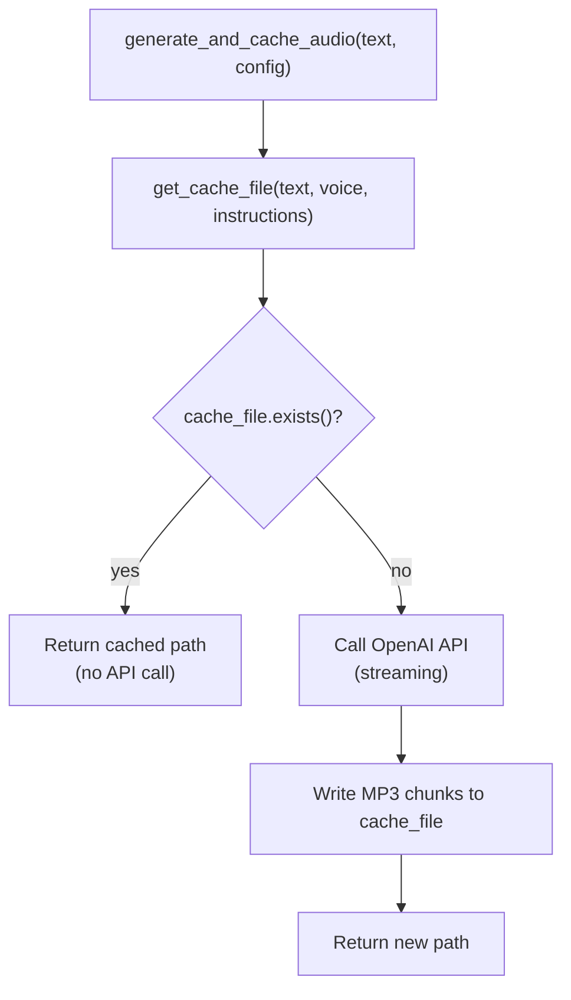

## Overview

The cache system stores generated MP3 files on disk to avoid re-calling the OpenAI TTS API for identical requests. Cache keys are MD5 hashes derived from the combination of input text, voice, and instruction parameters.

## Cache Key Generation

`generate_cache_key(text, voice, instructions)` in `cache.py` constructs a deterministic key:

1. Concatenates the three parameters with `::` as a separator: `"{text}::{voice}::{instructions}"`
2. UTF-8 encodes the string
3. Computes the MD5 digest, returning a 32-character hex string

All three parameters are included in the key, so changing any one of them — including only the voice or the instruction prompt — produces a distinct cache entry. This means the same spoken text with a different voice or tone instruction is cached separately.

## Cache Directory

`get_cache_dir()` in `config.py` resolves the directory via `platformdirs.user_cache_dir("speaky")`:

| Platform | Typical path |
| --- | --- |
| Linux | `~/.cache/speaky` |
| macOS | `~/Library/Caches/speaky` |
| Windows | `%LOCALAPPDATA%\speaky\Cache` |

The function calls `mkdir(parents=True, exist_ok=True)` on every invocation, so the directory is created on first use and subsequent calls are no-ops.

## File Naming and Format

`get_cache_file(text, voice, instructions)` combines the MD5 hash with the `.mp3` extension:

```
{cache_dir}/{md5_hash}.mp3
```

Example path on Linux: `~/.cache/speaky/a3f2c1...8d4e.mp3`

Only `.mp3` files are stored. The format is fixed at MP3 because the OpenAI call sets `response_format: "mp3"` and the VLC player reads the file directly.

## Cache Lookup in the TTS Flow



The existence check (`cache_file.exists()`) is the only cache validation. There is no TTL, checksum verification, or size check on the cached file. A cached file is assumed to be valid for its entire lifetime.

## Cache Clearing

`clear_cache()` globs `*.mp3` inside the cache directory and calls `unlink()` on each match. Non-MP3 files in the cache directory are left untouched. After deletion, it prints the path of the cleared directory to stdout.

The CLI exposes this via `speaky --clear-cache`. The flag takes effect before any TTS generation; the process exits immediately after clearing.

## Design Decisions

- **MD5 over SHA**: MD5 is faster and the 32-character output is compact. Collision resistance for this key space (short natural language strings combined with a small set of voices and instructions) is sufficient. MD5 is not used for any security purpose.
- **No TTL or invalidation**: The OpenAI TTS model and voice settings are fixed in config. Because the same `(text, voice, instructions)` triple will always produce equivalent audio, stale cache entries are not a concern under normal use. Invalidation is manual via `--clear-cache`.
- **Flat directory, no subdirectories**: All `.mp3` files live directly under `~/.cache/speaky/`. The MD5 hash provides adequate uniqueness without directory sharding.
- **`.mp3` extension hard-coded in filename**: Matches the `response_format` setting in config. If the format were ever changed, existing cache files would be ignored (their keys would differ because the format is not part of the key — but the new files would have the wrong extension). This is a known limitation.
