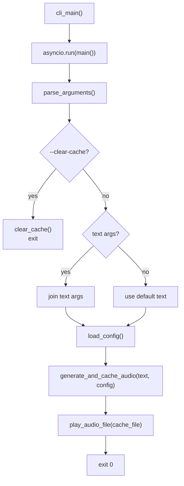

## Overview

`main.py` is the CLI entry point. It parses arguments with `argparse`, runs the async orchestration function, and maps errors to exit codes. The console script `speaky` is registered in `pyproject.toml` and calls `cli_main` directly.

## Argument Surface

| Argument | Type | Required | Default | Behaviour |
| --- | --- | --- | --- | --- |
| `text` | positional, `nargs="*"` | No | `[]` | One or more words; joined with a space before passing to TTS |
| `--clear-cache` | flag | No | `False` | Deletes all `.mp3` files from the cache directory and exits |

When `text` is empty (no positional arguments), the default string `"What would you like me to say?"` is used as the TTS input.

## Execution Flow



## Error Handling and Exit Codes

| Exception type | Exit code | Message printed |
| --- | --- | --- |
| `ValueError` | 1 | `"Configuration Error: {e}"` |
| `ImportError` | 1 | `"Error: Required package not installed"` |
| Any other `Exception` | 1 | `"Unexpected error: {e}"` |
| `KeyboardInterrupt` (in `cli_main`) | 1 | `"Interrupted by user"` |

`KeyboardInterrupt` is caught in `cli_main` (the synchronous wrapper), not inside the async `main` function. All other exceptions are caught inside `main` and result in `sys.exit(1)`.

## Entry Point Registration

`pyproject.toml` declares:

```
[project.scripts]
speaky = "speaky.main:cli_main"
```

After `pip install .` or `uv pip install .`, the `speaky` executable on the `PATH` calls `cli_main` directly. The `if __name__ == "__main__": cli_main()` block at the bottom of `main.py` allows the module to be run directly with `python -m speaky.main` as well.

## Async Architecture

`cli_main` is synchronous. It calls `asyncio.run(main())` which creates a new event loop, runs the `main` coroutine to completion, and closes the loop. The `main` coroutine is `async` solely to be able to `await generate_and_cache_audio`, which is async because it uses `AsyncOpenAI`.

There is one event loop per CLI invocation. No background tasks or concurrent coroutines are created.

## Design Decisions

- **`nargs="*"` for text**: Allows `speaky hello world` without quoting, joining the tokens into a single string. Users can also use `speaky "hello world"` for clarity; both produce the same input string.
- **Default text on empty input**: Running `speaky` with no arguments produces audible output rather than an error. This aids discoverability and is useful in scripting contexts where the input might occasionally be empty.
- **`cli_main` as thin wrapper**: Keeping the async logic in `main()` and the sync entry in `cli_main()` makes the async function directly testable with `pytest-asyncio` without invoking the event loop wrapper.
