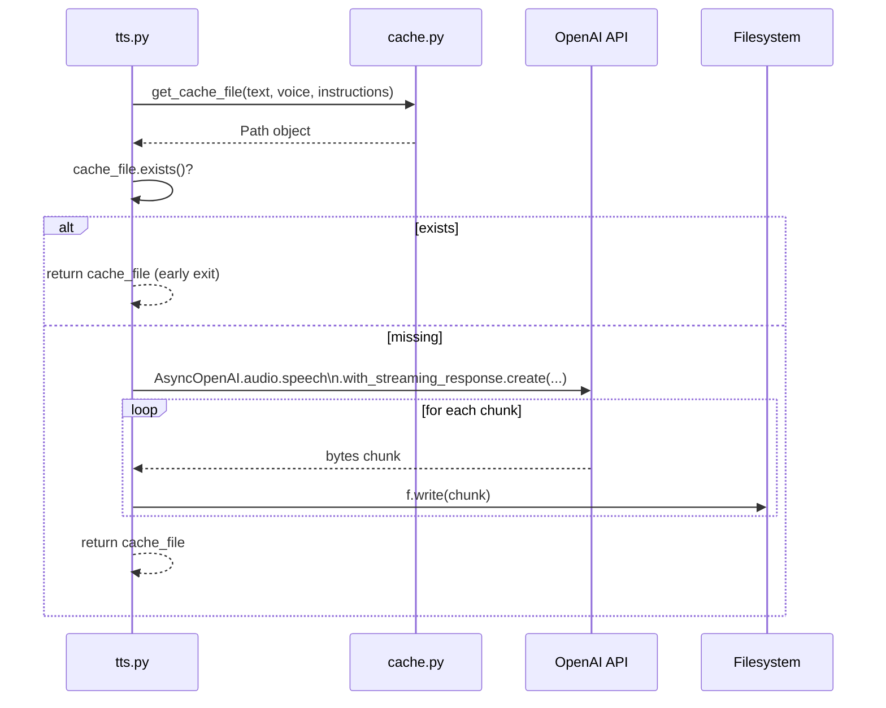

## Overview

`tts.py` calls the OpenAI TTS API using the async client, streams the MP3 response in binary chunks, and writes each chunk directly to a cache file. The function is a cache-aside pattern: it checks for a cached file first and only calls the API on a cache miss.

## API Call Details

The integration uses `openai.AsyncOpenAI` with the `with_streaming_response` variant of `audio.speech.create`. This keeps the HTTP response body open while chunks are read, avoiding buffering the entire audio file in memory before writing.

Parameters passed to the API:

| Parameter | Value | Source |
| --- | --- | --- |
| `model` | `gpt-4o-mini-tts` | `config["model"]` |
| `voice` | `nova` | `config["voice"]` |
| `input` | user-supplied text | `text` argument |
| `instructions` | `"Speak in a cheerful, positive yet professional tone."` | `config["instructions"]` |
| `response_format` | `mp3` | `config["response_format"]` |

All five parameters come from the config dict assembled by `load_config()`. The `instructions` field is a prompt that guides the voice model's delivery style.

## Streaming Write Flow

The file is opened with `"wb"` before the async iteration begins. Each chunk yielded by `response.iter_bytes()` is written synchronously. If the API call or any chunk write raises an exception, the partially written file is left on disk but will not be found on a future lookup (the cache key check uses `cache_file.exists()`, and the file will exist but be incomplete). This is a known edge case with no cleanup logic.

## Client Instantiation

A new `AsyncOpenAI` instance is created on each call to `generate_and_cache_audio`. The API key is read from `config["api_key"]` (sourced from the `OPENAI_API_KEY` environment variable). No persistent client or connection pool is maintained across invocations.

## Function Signature

`generate_and_cache_audio(text: str, config: dict) -> Path`

- `text`: the string to synthesise
- `config`: dict with keys `api_key`, `model`, `voice`, `instructions`, `response_format`
- Returns: a `Path` pointing to the MP3 file (either cached or newly written)
- Raises: any exception thrown by the OpenAI client or file I/O is propagated to the caller without wrapping

## Dependencies

- `openai[voice-helpers] >= 1.98.0`: the `[voice-helpers]` extra installs `pyaudio` and related packages alongside the OpenAI client. The `AsyncOpenAI` class and `with_streaming_response` are part of the core `openai` package.

## Design Decisions

- **Streaming over full download**: `with_streaming_response` avoids holding the complete audio file in memory. For short TTS responses this matters less, but for longer inputs it prevents memory spikes.
- **Async client**: The CLI main loop uses `asyncio.run`, so the async client integrates naturally. A sync client would require `asyncio.run_until_complete` or equivalent nesting.
- **No retry logic**: Failed API calls propagate immediately as exceptions. Retry behaviour is left to the caller or to the OpenAI client's internal defaults.
- **Fixed voice and model in config**: The voice (`nova`) and model (`gpt-4o-mini-tts`) are hard-coded in `load_config()`. Changing them requires modifying `config.py` directly; there are no CLI flags for voice selection.
