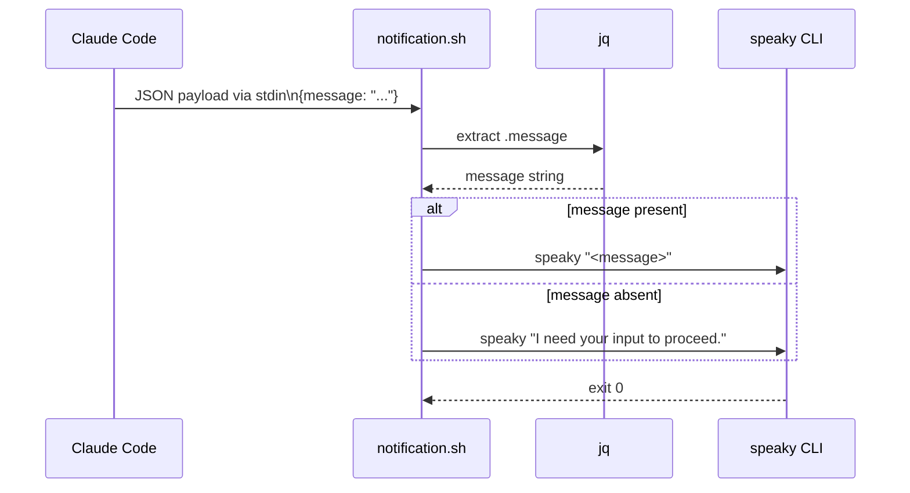

## Overview

The `usage-examples/` directory contains three integration patterns showing how to call `speaky` from automation contexts. These are reference examples, not part of the installed package.

## Direct CLI

`usage-examples/cli.md` — the most basic invocation:

```
speaky "Your text"
```

Text containing spaces must be quoted or passed as multiple positional arguments. Both `speaky "hello world"` and `speaky hello world` produce the same TTS input.

## Makefile Integration

`usage-examples/makefile.md` demonstrates using `speaky` as an audio notification layer in a build pipeline:

```make
.NOTPARALLEL: api-spec
app-test:
    @set -e
    @pnpm run test || (speaky "APP tests failed!"; exit 1)
    @speaky "All tests passed."
```

Key aspects:
- `speaky` is called inline in shell recipe steps
- Failure notification uses a subshell `(speaky "..."; exit 1)` to speak the message before propagating the non-zero exit
- `.NOTPARALLEL` prevents race conditions on the named target, though this is unrelated to `speaky`

## Claude Code Hook Integration

`usage-examples/claude-hooks/` provides a hook that speaks Claude Code's notification messages aloud.

### Hook Script

`usage-examples/claude-hooks/.claude/hooks/notification.sh` reads the JSON payload from stdin, extracts the `.message` field with `jq`, falls back to a configurable string if the field is absent, then calls `speaky` with the resulting text.

The script requires `jq` to be installed. If the payload does not contain a `.message` field, it uses the first argument to the script or the string `"I need your input to proceed."` as the fallback.

### Settings Configuration

`usage-examples/claude-hooks/.claude/settings.json` registers the script as a `Notification` hook:

```json
{
  "hooks": {
    "Notification": [
      {
        "matcher": "",
        "hooks": [
          {
            "type": "command",
            "command": ".claude/hooks/notification.sh"
          }
        ]
      }
    ]
  }
}
```

The empty `matcher` string matches all notification events. Copy this settings block into `.claude/settings.json` in the target project and place the shell script at `.claude/hooks/notification.sh`.

### Data Flow


